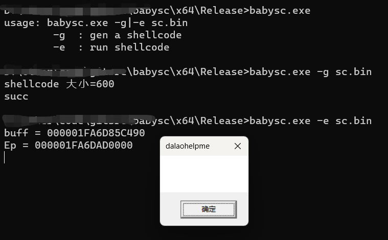

# babysc
 自用的shellcode生成框架

## 用法
1. 自己写好功能函数
2. 将函数名称放到 `order.txt` 文件里面`_main`前面即可
3. 编译下,确认生成了exe文件
4. 执行 `babysc -g shellcode导出文件`, 将你写的功能函数提取出来到sc.bin
5. 验证,  通过 `babysc -e shellcode导出文件`，执行下观察是否达到预期


### 以`winexe`方式命令执行为例说明

1. 先完成功能函数

```C
void* sc_exec()
{
	NativeApi func;	// 上下文，里面有需要用到的`全局`变量
	init_api(&func);	// 初始化下，一般在里面获取函数地址之类的
	
	// 方式一：硬编码你的命令
	char cmdline[] = { 109, 115, 112, 97, 105, 110, 116, 46, 101, 120, 101 , 0 };	// mspaint.exe
	
	// 方式二：将要执行的命令放在我shellcode后面，这样的好处就是，shellcode生成一次，要执行的命令可以通过修改尾部数据达到动态修改的目的
	// char* cmdline = (char*)main_end + (UINT32)get_rtoffset();
	
	
	func.winexec(cmdline, SW_SHOW);
	return 0;
}
```

2. 将 `sc_exec` 放到 `order.txt` 里面
```
main_entry
get_rtoffset
get_kernel32
get_export_byhash
get_import_module
calc_hash
init_api
strlen_me

sc_msgbox

_main
main_end

```

3. 编译，执行下


## 其他
1. 批量提取kernel32, ntdll hash的工具有需要的话找找传上来
2. 代码生成 Release 版用 MT , 务必!


